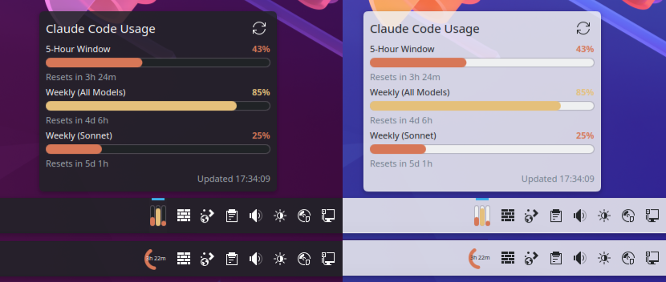

# Claude Meter

[](https://www.pling.com/p/2348058/)

A KDE Plasma 6 panel applet that monitors your Claude Code rate limits.



## Features

- Displays the 5-hour and 7-day (all models) rate limit windows
- Adds a separate bar for any active model-specific weekly limit returned by the API (e.g. Opus, Cowork), discovered dynamically so new plan tiers work without an update
- Two compact panel styles: stacked bars or circular gauge
- Configurable warning/critical thresholds with color coding
- Customizable bar colors
- Auto-refreshes on a configurable polling interval
- Warning icon when credentials are missing or the API returns an error

## How It Works

1. Reads the OAuth token from `~/.claude/.credentials.json` (created by the Claude Code CLI when you sign in)
2. Calls `GET https://api.anthropic.com/api/oauth/usage` with a bearer token
3. Parses the response for the 5-hour and 7-day windows, plus any `seven_day_*` per-model entries that have an active limit or non-zero utilization
4. The token is passed to `curl` via stdin (not as a command-line argument, which would be visible in `/proc`)

> **Note:** This widget uses an internal Anthropic API endpoint that is not part of the public API documentation. It may change or stop working without notice.

## Requirements

- KDE Plasma 6
- Claude Code CLI with an active subscription (Pro or Max)
- `python3`
- `curl`

## Install

### From the KDE Store

Browse to [Claude Meter on the KDE Store](https://www.pling.com/p/2348058/) and click **Install**, or use Discover (KDE's software center) to search for "Claude Meter".

### From source

```sh
git clone https://github.com/p3kj/plasma-applet-claudemeter.git
cd plasma-applet-claudemeter
bash install.sh
```

Then add the "Claude Meter" widget to your panel.

## Uninstall

```sh
kpackagetool6 -t Plasma/Applet -r com.github.p3kj.claudemeter
```

## Configuration

Right-click the widget and select "Configure...". Options include:

- **Panel style** - bars (stacked) or gauge (circular arc)
- **Gauge metric** - 5-hour window, 7-day (all models), or the most-utilized active per-model weekly
- **Poll interval** - how often to fetch usage data (default: 900s)
- **Warning / Critical thresholds** - percentage thresholds for color changes
- **Colors** - customize the normal and warning bar colors
- **Claude folder** - path to an alternate Claude config folder (default: `~/.claude`). Useful if you run multiple accounts via `CLAUDE_CONFIG_DIR`, e.g. `~/.claude-personal`. Add one widget instance per account to monitor them side by side
- **Proxy** - optionally route the usage request through an HTTP, HTTPS, or SOCKS5 proxy. Enable "Use proxy" and set the type, host, port, and optional username/password. The proxy password is passed to `curl` via stdin (not as a command-line argument)

## Troubleshooting

- **Widget shows a warning icon** - make sure you are signed into the Claude Code CLI (`claude` in a terminal). The widget reads your OAuth token from `~/.claude/.credentials.json`, which is created on sign-in.
- **"Unauthorized" or 401 errors** - your token may have expired. Run `claude` again to refresh it.
- **No data after install** - wait for the first poll interval (default 15 minutes), or right-click the widget and reconfigure with a shorter interval for testing.
- **429 "Too Many Requests" errors** - the Anthropic API rate-limits usage polling. The default 15-minute interval should be safe, but if you set a very short poll interval you may get throttled. Increase the interval in the widget configuration if this happens.

## License

[MIT](LICENSE)
